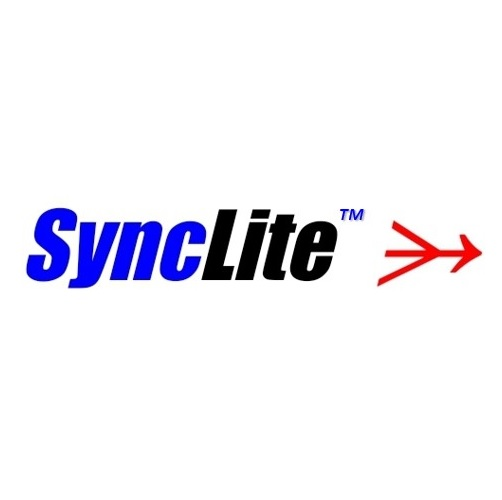
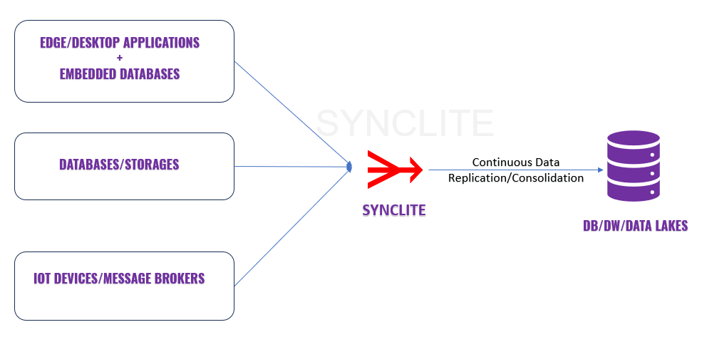

<p align="center">
  <a href="https://www.synclite.io">
  
  </a>
  <p align="center">
    <a href="https://www.synclite.io">Learn more</a>
    ·
    <a href="https://join.slack.com/t/syncliteworkspace/shared_invite/zt-2pz945vva-uuKapsubC9Mu~uYDRKo6Jw">Chat on Slack</a>
  </p>
</p>

# SyncLite - Build Anything Sync Anywhere

<a href=https://www.synclite.io>SyncLite</a> is an open-source, low-code, comprehensive relational data consolidation platform enabling developers to rapidly build data intensive applications for edge, desktop and mobile environments. SyncLite enables real-time, transactional data replication and consolidation from various sources including edge/desktop applications using popular embedded databases (SQLite, DuckDB, Apache Derby, H2, HyperSQL), data streaming applications, IoT message brokers, traditional database systems(ETL) and more into a diverse array of databases, data warehouses, and data lakes, enabling AI and ML use-cases at edge and cloud.

```
{Edge/Desktop Apps} + {SyncLite Logger} ---> {Staging Storage} ---> {SyncLite Consolidator} ---> {Destination DB/DW/DataLakes}
```

<p align="center">
  <a href="https://www.synclite.io">
  
  </a>
</p>

SyncLite enables following scenarios for industry leading databases, data warehouse and data lakes.

## Build Sync-Ready Applications: 
SyncLite provides a novel CDC replication framework for embedded databases, helping developers quickly build data-intensive applications, including Gen AI Search and RAG applications, for edge, desktop, and mobile environments. It integrates seamlessly with popular embedded databases like SQLite, DuckDB, Apache Derby, H2, and HyperSQL (HSQLDB), enabling Change Data Capture (CDC), transactional, real-time data replication, and consolidation into industry-leading databases, data warehouses, and data lakes. 

```SyncLite Logger```, an embeddable Java library (JDBC driver), captures all SQL transactions in log files that can be consumed by Java and Python applications for efficient data syncing.

```SyncLite DB```, a standalone sync-enabled database, accepts SQL requests in JSON format over HTTP, making it compatible with any programming language (Java, Python, C++, C#, Go, Rust, Ruby, Node.js etc.) and ideal for flexible, real-time data integration and consolidation, right from edge/desktop applications into final data destinations.
```

{Edge/Desktop Apps} + {SyncLite Logger + Embedded Databases} ---> {Staging Storage} ---> {SyncLite Consolidator} ---> {Destination DB/DW/DataLakes}
```

```
{Edge/Desktop Apps} ---> {SyncLite DB + Embedded Databases} ---> {Staging Storage} ---> {SyncLite Consolidator} ---> {Destination DB/DW/DataLakes}
```

Learn more: 

https://www.synclite.io/synclite/sync-ready-apps

https://www.synclite.io/solutions/gen-ai-search-rag


## Build Streaming Applications For Last Mile Delivery: 
SyncLite facilitates development of large-scale data streaming applications through SyncLite Logger, which offers both a Kafka Producer API and SQL API. This allows for the ingestion of massive amounts of data and provides the capability to query the ingested data using the SQL API within applications. Together, SyncLite Logger and SyncLite Consolidator enable seamless last-mile data integration from thousands of streaming application instances into a diverse array of final data destinations.

```
{Data Streaming Apps} + {SyncLite Logger} ---> {Staging Storage} ---> {SyncLite Consolidator} ---> {Destination DB/DW/DataLakes}
```

```
{Data Streaming Apps} ---> {SyncLite DB} ---> {Staging Storage} ---> {SyncLite Consolidator} ---> {Destination DB/DW/DataLakes}
```

Learn more: https://www.synclite.io/synclite/last-mile-streaming


## Deploy Database ETL/Replication/Migration Pipelines:
Set up many-to-many, scalable database replication/migration/incremental ETL pipelines from a diverse range of source databases and raw data files into a diverse range of destinations.

```
{Source Databases} ---> {SyncLite DBReader} ---> {Staging Storage} ---> {SyncLite Consolidator} ---> {Destination DB/DW/DataLakes}
```

Learn More: https://www.synclite.io/solutions/smart-database-etl

## Setup Rapid IoT Data Connectors:
Connect numerous MQTT brokers (IoT gateways) to one or more destination databases.

```
{IoT Message Brokers} ---> {SyncLite QReader} ---> {Staging Storage} ---> {SyncLite Consolidator} ---> {Destination DB/DW/DataLakes}
```

Learn More: https://www.synclite.io/solutions/iot-data-connector

# SyncLite Components

```SyncLite Logger``` is a JDBC driver, enables developers to rapidly build 
	
-sync-enabled, robust, responsive, high-performance, low-latency, transactional, data intensive applications for edge/mobile/desktop platforms using their favorite embedded databases (SQLite, DuckDB, Apache Derby, H2, HyperSQL)
  	
-large scale data streaming solutions for last mile data integrations into a wide range of industry leading databases, while offering ability to perform real-time analytics using the native embedded databases over streaming data, at the producer end of the pipelines.

```SyncLite DB``` is a sync-enabled, single-node database server that wraps popular embedded databases like SQLite, DuckDB, Apache Derby, H2, and HyperSQL. Unlike the embeddable SyncLite Logger library for Java and Python applications, SyncLite DB acts as a standalone server, allowing your edge or desktop applications—regardless of the programming language—to connect and send SQL requests (wrapped in JSON format) over a network socket. 

```SyncLite Client``` is a command line tool to operate SyncLite devices, to execute SQL queries and workloads.

```SyncLite DBReader``` enables data teams and data engineers to configure and orchestrate many-to-many, highly scalable, incremental/log-based database ETL/replication/migration jobs across a diverse array of databases, data warehouses and data lakes.

```SyncLite QReader``` enables developers to integrate IoT data published to message queue brokers, into a diverse array of databases, data warehouses and data lakes, enabling real-time analytics and AI use cases at all three levels: edge, fog and cloud.

```SyncLite Consolidator``` is the centralized application to all the reader/producer tools mentioned above, which receives and consolidates the incoming data and log files in real-time into one or more databases, data warehouses and data lakes of user’s choice. SyncLite Consolidator also offers additional features: table/column/value filtering and mapping, data type mapping, database trigger installation, fine-tunable writes, support for multiple destinations and more.

```SyncLite JobMonitor``` enables managing, scheduling and monitoring all SyncLite jobs created on a given host.

```SyncLite Validator``` is an E2E integration testing tool for SyncLite.

# Build SyncLite

1. If you are using a pre-built release then ignore this section. 
2. Install/Download Apache Maven(3.8.6 or above): https://maven.apache.org/download.cgi
3. If you opt to not use the deploy scripts generated in the release which download the prerequisite software : Apache Tomcat and OpenJDK, then manually install them
	
 	a. OpenJDK 11 : https://jdk.java.net/java-se-ri/11
	
 	b. Apache Tomcat 9.0.93 : https://tomcat.apache.org/download-90.cgi

5. Run following: 
	```
	git clone --recurse-submodules git@github.com:syncliteio/SyncLite.git SyncLite
	
	cd SyncLite
	
	mvn -Drevision=oss clean install
	
	```
6. Release is created under SyncLite/target

## Release Structure:

The build process creates following release structure under SyncLite\target: 
```
synclite-platform-<version>
|
|
--------lib
|       |
|       |
|        --------logger
|       |        |
|       |        |
|       |        --------java
|       |        |        |
|       |        |        |    
|       |        |        --------synclite-logger-<version>.jar   ==> SyncLite Logger JDBC driver, to be added as a depependency in your edge apps
|       |        |
|       |        |
|       |        --------synclite_logger.conf  ==> A sample configuration file for SyncLite logger.
|       |
|       |
|       --------consolidator
|       |        |
|       |        |
|       |        --------synclite-consolidator-<version>.war   ==> SyncLite Consolidator application, to be deployed on an application server such as Tomcat on a centralized host
|
|
|
|
--------sample-apps
|        |
|        |
|        --------jsp-servlet
|        |        |
|        |        |
|        |        --------web
|        |        |
|        |        |
|        |        --------src          ==> Source code of a sample Jsp Servlet app that demonstrates usage of synclite-logger
|        |        |
|        |        |
|        |        --------target        
|        |        |
|        |        |
|        |        --------synclite-sample-app-<version>.war
|        |        
|        |
|        --------java
|        |        |
|        |        |
|        |        --------*.java    => Java source files demonstrating SyncLite logger usage.
|        |        |
|        |        |
|        |        --------README
|        |
|        |
|        |
|        |
|        --------python
|                |
|                |
|                --------*.py    => Python source files demonstrating SyncLite logger usage.
|                |
|                |
|                --------README
|
|
|
|
--------bin
|        |
|        |
|        --------deploy.bat/deploy.sh    ==> Deployment script for deploying SyncLite consolidator and sample application from the lib directory
|        |                    
|        |                        
|        --------start.bat/start.sh    ==> Launch script to start tomcat and the deployed SyncLite applications.
|        |             
|        |           
|        --------docker-deploy.sh/docker-start.sh   ==> Deployment and launch scripts for running SyncLite Consolidator inside a docker container. 
|        |             
|        |           
|        --------stage
|        |        |         
|        |        |         
|        |        --------sftp    ==> Contains docker-deploy.sh,docker-start.sh, docker-stop.sh scripts to launch SFTP server as SyncLite stage
|        |        |         
|        |        |                                   
|        |        --------minio   ==> Contains docker-deploy.sh, docker-start.sh, docker-stop.sh scripts to launch MinIO server as SyncLite stage
|        |       
|        |       
|        |       
|        --------dst
|                |
|                |                
|                --------postgresql  ==> Contains docker-deploy.sh,docker-start.sh scripts to launch PostgrSQL server as SyncLite destination DB
|                |         
|                |                                  
|                --------mysql   ==> Contains docker-deploy.sh, docker-start.shscripts to launch MySQL server as SyncLite destination DB
| 
|
|
--------tools
        |
        |
        --------synclite-client   ==> Client tool to execute SQL operations on SyncLite databases/devices.
	|
	|
        --------synclite-db    ==> A standalone database server offering sync-enabled embedded databases for edge/desktop applications. 
	|
	|
        --------synclite-dbreader    ==> Smart database ETL/Replication/Migration tool
	|
	|
	--------synclite-qreader     ==> Rapid IoT data connector tool
	|
	|
	--------synclite-job-monitor   ==> Job Monitor tool to manage, monitor and schedule SyncLite jobs.
	|
	|
        --------synclite-validator    ==> An E2E integration testing tool for SyncLite
 

```

### Quick Start - Native/Docker based

NOTE: Below instructions enable a quick start and trial of SyncLite platform. 
For production usage, it is recommended to go through installation process to install OpenJDK11 and Tomcat9 (as a service) 
on your Windows/Ubuntu host.

1. Enter bin directory.

2. (One time) Run ```deploy.bat```(WINDOWS) / ```deploy.sh``` (UBUNTU) to deploy the SyncLite consolidator and a SyncLite sample application.
   
   OR Run ```docker-deploy.sh``` (UBUNTU) to deploy a docker container for SyncLite platform.

   OR Manually deploy below war files on your tomcat server:
   - ```SyncLite\target\synclite-platform-dev\lib\consolidator\synclite-consolidator-oss.war```,
   - ```SyncLite\target\synclite-platform-dev\sample-apps\jsp-servlet\web\target\synclite-sample-app-oss.war```
   - ```SyncLite\target\synclite-platform-dev\tools\synclite-dbreader\synclite-dbreader-oss.war```
   - ```SyncLite\target\synclite-platform-dev\tools\synclite-dbreader\synclite-qreader-oss.war```
   - ```SyncLite\target\synclite-platform-dev\tools\synclite-dbreader\synclite-jobmonitor-oss.war```
     
   
3. Run ```start.bat```(WINDOWS) / ```start.sh```(UBUNTU) to start tomcat and the deployed SyncLite applications. (Please note the username/password for tomcat manager web console is synclite/synclite)

   OR Run ```docker-start.sh``` to run the docker container (Please check options passed to docker run command e.g. the home directory of the current user is mapped to ```/root``` inside docker to persist all the
   SyncLite storage in the native host).

   OR manually start applications from your tomcat manager console.

4. Open tomcat manager console http://localhost:8080/manager (Use synclite/synclite as the default user/password when prompted as set by the deploy script). The manager web console will show all the SyncLite applications deployed. 

5. Open http://localhost:8080/synclite-consolidator to launch SyncLite Consolidator application

6. Open http://localhost:8080/synclite-sample-app to launch SyncLite sample web application 

7. Configure and start SyncLite consolidator job in the SyncLite Consolidator application. You can follow through the "Configure Job" wizard reviewing all the default configuration values. Create databases/devices of any type from the deployed sample web application and execute SQL workloads on several devices at once specifying the device index range. Observe data consolidator in the SyncLite Cosolidator dashboard. You can check device specific data consolidation progress on individual device pages (from "List Devices" page), query destination database on the "Analyze Data" page. 

8. This release also comes with a CLI client for SyncLite under tools/synclite-client. You can run synclite-client.bat(WINDOWS)/synclite-client.sh (UBUNTU) to start the client tool and execute SQL operations which are not only executed/persisted on the native database but also consolidated by the SyncLite consolidator into destination DB.
   - Usage 1 : ```synclite-client.bat/synclite-client.sh ==> Will start with DB = <USER.HOME>/synclite/job1/db/test.db, DEVICE_TYPE = SQLITE, CONFIG = <USER.HOME>/synclite/db/synclite_logger.conf```
   - Usage 2 : ```synclite-client.bat/synclite-client.sh <path/to/db/file> --device-type <SQLITE|DUCKDB|DERBY|H2|HYPERSQL|STREAMING|SQLITE_APPENDER|DUCKDB_APPENDER|DERBY_APPENDER|H2_APPENDER|HYPERSQL_APPENDER> --synclite-logger-config <path/to/synclite/logger/config> --server <SyncLite DB Address>```
   - Note: If --sever switch is specified then the client connects to SyncLite DB to  execute SQL statements, else it usages embedded ```SyncLite Logger``` library to directly operate on the devices.
     
9. This release also comes with SyncLite DB server under tools/synclite-db. You can run synclite-db.bat(WINDOWS)/synclite-db.sh(UBUNTU) to start SyncLite DB server and connect to it using synclite-client to execute SQL operations which are not only executed/persisted on the specified embedded database but also consolidated by the SyncLite Consolidator onto the destination databases.
   - Usage 1 : ```synclite-db.bat/synclite-db.sh``` ==> Will start SyncLite DB with default configurations
   - Usage 2 : ```synclite-db.bat/synclite-db.sh --config <path/to/synclite-db/config>```
          
10. Use ```stop.bat``` (Windows) / ```stop.sh```(LINUX) to stop SyncLite consolidator job (if running) and tomcat.
   OR RUN docker-stop.sh to stop the docker container.

11. Refer ```sample_apps/java``` and ```samples_apps/python``` and use any of them as a starting point to build your own application.

12. You can install/use a database of your choice and  perform data consolidation to it (instead of the default SQLite destination): PostgreSQL, MySQL, MongoDB, SQLite, DuckDB.

13. This release also packages docker scripts to setup PostgreSQL and MySQL to serve as SyncLite destinations.
    - ```bin/dst/postgresql``` contains ```docker-deploy.sh```, ```docker-start.sh``` and ```docker-stop.sh```
    - ```bin/dst/mysql``` contains ```docker-deploy.sh```, ```docker-start.sh``` and ```docker.stop.sh```

14. You can deploy your applications on remote hosts/devices and share the local-stage-directory of your respective SyncLite applications with SyncLite Consolidator host via one of the following file staging storages: 
    - SFTP
    - Amazon S3
    - MinIO Object Storage Server
    - Apache Kafka
    - Microsoft OneDrive
    - Google Drive
    - NFS Sharing
    - Local Network Sharing
      
Please check documentation for setting up these staging storages for SyncLite : https://www.synclite.io/resources/documentation
 
15. This release also packages docker scripts to setup SFTP and MinIO servers to serve as SyncLite stage.
    - ```bin/stage/sftp```  contains ```docker-deploy.sh```, ```docker-start.sh``` and ```docker-stop.sh```
    - ```bin/stage/minio``` contains ```docker-deploy.sh```, ```docker-start.sh``` and ```docker-stop.sh```
      NOTE: These scripts contain default configurations. You must change usernames, passwords and setup any additional security mechanisms on top of these basic setups. 

16. The SyncLite docker scripts ```bin/docker-deploy.sh```, ```bin/docker-start.sh```, ```bin/docker-stop.sh``` contain two variables at the top to choose a stage and destination:
    - STAGE : Set it to SFTP or MINIO.
    - DST : Set it to POSTGRESQL or MYSQL.

      Once you set the STAGE and DST to appropriate values e.g. SFTP and POSTGRESQL, the ```docker-deploy.sh``` and ```docker-start.sh``` scripts will bring up docker containers for SyncLite consolidator, SFTP
      server and PostgreSQL server and you will be all set to configure and start a SyncLite consoldiator job be able to consolidate data into PostgreSQL server received from remote SyncLite applications
      configured to connect to the SFTP stage. 

17. After a successful trial, if you need to perform another trial, stop the docker containers, and delete contents under ```/home/synclite``` to start a fresh trial of a different scenario etc.

18. Open http://localhost:8080/synclite-dbreader (and open http://localhost:8080/synclite-consolidator) to setup database ETL/Replication/Migration pipelines.

19. Open http://localhost:8080/synclite-qreader (and open http://localhost:8080/synclite-consolidator) to setup rapid IoT pipelines.

20. Open http://localhost:8080/synclite-job-monitor to manage, monitor and schedule various SyncLite jobs.
    
Refer documentation at https://www.synclite.io/resources/documentation for more details.

NOTE : For production usage, it is recommended to install OpenJDK11 and Tomcat as a service (or any other application server of your choice) and deploy SyncLite consolidator web archive release, Please refer our documentation at www.synclite.io for detailed installation steps for Windows and Ubuntu.


# Using SyncLite Logger

Add ```synclite-logger-<version>.jar``` file created as part of the above build as a dependency in your application.

## Configuration File

Refer ```src/main/resources/synclite_logger.conf``` file for all available configuration options for SyncLite Logger. Refer "SyncLite Logger Configuration" section in the documentation at https://www.synclite.io/resources/documentation for more details about all configuration options. 

## Application Code Samples (SQL API)

Refer below code samples to build applications using SyncLite Logger. 

### Transactional Devices : 

Transactional devices (SQLite, DuckDB, Apache Derby, H2, HyperSQL) support all database operations and perform transactional logging of all the DDL and DML operations performed by the application. These enable  developers to build use cases such as building data-intensive sync-ready applications for edge, edge + cloud GenAI search and RAG applications, native SQL (hot) hot data stores, SQL application caches, edge enablement of cloud databases and more.

#### Java
```
package testApp;

import java.nio.file.Path;
import java.sql.Connection;
import java.sql.DriverManager;
import java.sql.PreparedStatement;
import java.sql.SQLException;
import java.sql.Statement;
import io.synclite.logger.*;


public class TestTransactionalDevice {
	
	public static Path syncLiteDBPath;
	public static void appStartup() throws SQLException, ClassNotFoundException {
		syncLiteDBPath = Path.of(System.getProperty("user.home"), "synclite", "db");
		Class.forName("io.synclite.logger.SQLite");
		//
		//////////////////////////////////////////////////////
		//For other types of transactional devices : 
		//DuckDB : Class.forName("io.synclite.logger.DuckDB");
		//Apache Derby : Class.forName("io.synclite.logger.Derby");
		//H2 : Class.forName("io.synclite.logger.H2");
		//HyperSQL : Class.forName("io.synclite.logger.HyperSQL");
		//////////////////////////////////////////////////////
		//

		Path dbPath = syncLiteDBPath.resolve("test_tran.db");
		SQLite.initialize(dbPath, syncLiteDBPath.resolve("synclite_logger.conf"));
		//
		//////////////////////////////////////////////////////
		//For other types of transactional devices : 
		//DuckDB : DuckDB.initialize(dbPath, syncLiteDBPath.resolve("synclite_logger.conf"));
		//Apache Derby : Derby.initialize(dbPath, syncLiteDBPath.resolve("synclite_logger.conf"));
		//H2 : H2.initialize(dbPath, syncLiteDBPath.resolve("synclite_logger.conf"));
		//HyperSQL : HyperSQL.initialize(dbPath, syncLiteDBPath.resolve("synclite_logger.conf"));
		//////////////////////////////////////////////////////
		//
	}	
	
	public void myAppBusinessLogic() throws SQLException {
		//
		//Some application business logic
		//
		//Perform some database operations		
		try (Connection conn = DriverManager.getConnection("jdbc:synclite_sqlite:" + syncLiteDBPath.resolve("test_sqlite.db"))) {
			//
		        //////////////////////////////////////////////////////////////////
			//For other types of transactional devices use following connection strings :
			//For DuckDB : jdbc:synclite_duckdb:<db_path>
			//For Apache Derby : jdbc:synclite_derby:<db_path>
			//For H2 : jdbc:synclite_h2:<db_path>
			//For HyperSQL : jdbc:synclite_hsqldb:<db_path>
			///////////////////////////////////////////////////////////////////
			//
			try (Statement stmt = conn.createStatement()) { 
				//Example of executing a DDL : CREATE TABLE. 
				//You can execute other DDL operations : DROP TABLE, ALTER TABLE, RENAME TABLE.
				stmt.execute("CREATE TABLE IF NOT EXISTS feedback(rating INT, comment TEXT)");
				
				//Example of performing INSERT
				stmt.execute("INSERT INTO feedback VALUES(3, 'Good product')");				
			}
			
			//Example of setting Auto commit OFF to implement transactional semantics
			conn.setAutoCommit(false);
			try (Statement stmt = conn.createStatement()) { 
				//Example of performing basic DML operations INSERT/UPDATE/DELETE
				stmt.execute("UPDATE feedback SET comment = 'Better product' WHERE rating = 3");
				stmt.execute("INSERT INTO feedback VALUES (1, 'Poor product')");
				stmt.execute("DELETE FROM feedback WHERE rating = 1");
			}
			conn.commit();
			conn.setAutoCommit(true);
			
			//Example of Prepared Statement functionality for bulk insert.			
			try(PreparedStatement pstmt = conn.prepareStatement("INSERT INTO feedback VALUES(?, ?)")) {
				pstmt.setInt(1, 4);
				pstmt.setString(2, "Excellent Product");
				pstmt.addBatch();
				
				pstmt.setInt(1, 5);
				pstmt.setString(2, "Outstanding Product");
				pstmt.addBatch();
				
				pstmt.executeBatch();			
			}
		}
		//Close SyncLite database/device cleanly.
		SQLite.closeDevice(Path.of("test_sqlite.db"));
		//
		///////////////////////////////////////////////////////
		//For other types of transactional devices :
		//DuckDB : DuckDB.closeDevice
		//Apache Derby : Derby.closeDevice
		//H2 : H2.closeDevice
		//HyperSQL : HyperSQL.closeDevice
		//////////////////////////////////////////////////////
		//
		//You can also close all open databases in a single SQL : CLOSE ALL DATABASES
	}	
	
	public static void main(String[] args) throws ClassNotFoundException, SQLException {
		appStartup();
		TestTransactionalDevice testApp = new TestTransactionalDevice();
		testApp.myAppBusinessLogic();
	}
}

```
#### Python   

```
import jaydebeapi

props = {
  "config": "synclite_logger.conf",
  "device-name" : "tran1"
}
conn = jaydebeapi.connect("io.synclite.logger.SQLite",
                           "jdbc:synclite_duckdb:c:\\synclite\\python\\data\\test_sqlite.db",
                           props,
                           "synclite-logger-<version>.jar",)
#//
#////////////////////////////////////////////////////////////////
#For other types of transactional devices use following are the class names and connection strings :
#For DuckDB - Class : io.synclite.logger.DuckDB, Connection String : jdbc:synclite_duckdb:<db_path>
#For Apache Derby - Class : io.synclite.logger.Derby, Connection String : jdbc:synclite_derby:<db_path>
#For H2 - Class : io.synclite.logger.H2, Connection String : jdbc:synclite_h2:<db_path>
#For HyperSQL - Class : io.synclite.logger.HyperSQL, Connection String : jdbc:synclite_hsqldb:<db_path>
#/////////////////////////////////////////////////////////////////
#//

curs = conn.cursor()

#Example of executing a DDL : CEATE TABLE.
#You can execute other DDL operations : DROP TABLE, ALTER TABLE, RENAME TABLE.
curs.execute('CREATE TABLE IF NOT EXISTS feedback(rating INT, comment TEXT)')

#Example of performing basic DML operations INSERT/UPDATE/DELETE
curs.execute("insert into feedback values (3, 'Good product')")

#Example of setting Auto commit OFF to implement transactional semantics
conn.jconn.setAutoCommit(False)
curs.execute("update feedback set comment = 'Better product' where rating = 3")
curs.execute("insert into feedback values (1, 'Poor product')")
curs.execute("delete from feedback where rating = 1")
conn.commit()
conn.jconn.setAutoCommit(True)


#Example of Prepared Statement functionality for bulk insert.
args = [[4, 'Excellent product'],[5, 'Outstanding product']]
curs.executemany("insert into feedback values (?, ?)", args)

#Close SyncLite database/device cleanly.
curs.execute("close database c:\\synclite\\python\\data\\test_sqlite.db");

#You can also close all open databases in a single SQL : CLOSE ALL DATABASES
```

### Appender Devices :

Appender devices (SQLiteAppender, DuckDBAppender, DerbyAppender, H2Appender, HyperSQLAppender) support all DDL operations and Prepared Statement based INSERT operations, are highly optimized for high speed concurrent batched data ingestion, performing logging of ingested data. Unlike transactional devices, appender devices only allow INSERT DML operations (UPDATE and DELETE are not allowed). Appender devices enable developers to build high volume streaming applications enabled with last mile data integration from thousands of edge points into centralized database destinations as well as in-app analytics by enabling fast read access to ingested data from the underlying local embedded databases storing the ingested/streamed data.

#### Java

```
package testApp;

import java.nio.file.Path;
import java.sql.Connection;
import java.sql.DriverManager;
import java.sql.PreparedStatement;
import java.sql.SQLException;
import java.sql.Statement;
import io.synclite.logger.*;

public class TestAppenderDevice {
	public static Path syncLiteDBPath;

	public static void appStartup() throws SQLException, ClassNotFoundException {
		syncLiteDBPath = Path.of(System.getProperty("user.home"), "synclite", "db");
		Class.forName("io.synclite.logger.SQLiteAppender");
		//
		//////////////////////////////////////////////////////
		//For other types of appender devices : 
		//DuckDB : Class.forName("io.synclite.logger.DuckDBAppender");
		//Apache Derby : Class.forName("io.synclite.logger.DerbyAppender");
		//H2 : Class.forName("io.synclite.logger.H2Appender");
		//HyperSQL : Class.forName("io.synclite.logger.HyperSQLAppender");
		//////////////////////////////////////////////////////
		//
		Path dbPath = syncLiteDBPath.resolve("test_appender.db");
		SQLiteAppender.initialize(dbPath, syncLiteDBPath.resolve("synclite_logger.conf"));
	}

	public void myAppBusinessLogic() throws SQLException {
		//
		// Some application business logic
		//
		// Perform some database operations
		try (Connection conn = DriverManager.getConnection("jdbc:synclite_sqlite_appender:" + syncLiteDBPath.resolve("test_appender.db"))) {
			//
		        //////////////////////////////////////////////////////////////////
			//For other types of appender devices use following connection strings :
			//For DuckDBAppender : jdbc:synclite_duckdb_appender:<db_path>
			//For DerbyAppender : jdbc:synclite_derby_appender:<db_path>
			//For H2Appender : jdbc:synclite_h2_appender:<db_path>
			//For HyperSQLAppender : jdbc:synclite_hsqldb_appender:<db_path>
			///////////////////////////////////////////////////////////////////
			//
			try (Statement stmt = conn.createStatement()) {
				// Example of executing a DDL : CREATE TABLE.
				// You can execute other DDL operations : DROP TABLE, ALTER TABLE, RENAME TABLE.
				stmt.execute("CREATE TABLE IF NOT EXISTS feedback(rating INT, comment TEXT)");
			}

			//
			// Example of Prepared Statement functionality for bulk insert.
			// Note that Appender Devices allows all DDL operations, INSERT INTO DML operations (UPDATES and DELETES are not allowed) and SELECT queries.
			//
			try (PreparedStatement pstmt = conn.prepareStatement("INSERT INTO feedback VALUES(?, ?)")) {
				pstmt.setInt(1, 4);
				pstmt.setString(2, "Excellent Product");
				pstmt.addBatch();

				pstmt.setInt(1, 5);
				pstmt.setString(2, "Outstanding Product");
				pstmt.addBatch();

				pstmt.executeBatch();
			}
		}
		// Close SyncLite database/device cleanly.
		SQLiteAppender.closeDevice(Path.of("test_appender.db"));
		//
		///////////////////////////////////////////////////////
		//For other types of appender devices :
		//DuckDBAppender : DuckDBAppender.closeDevice
		//DerbyAppender : DerbyAppender.closeDevice
		//H2Appender : H2Appender.closeDevice
		//HyperSQLAppender : HyperSQLAppender.closeDevice
		//////////////////////////////////////////////////////
		//
		// You can also close all open databases/devices in a single SQL : CLOSE ALL
		// DATABASES
	}

	public static void main(String[] args) throws ClassNotFoundException, SQLException {
		appStartup();
		TestAppenderDevice testApp = new TestAppenderDevice();
		testApp.myAppBusinessLogic();
	}

}
```

#### Python

```
import jaydebeapi
props = {
  "config": "synclite_logger.conf",
  "device-name" : "appender1"
}
conn = jaydebeapi.connect("io.synclite.logger.SQLiteAppender",
                           "jdbc:synclite_sqlite_appender:c:\\synclite\\python\\data\\test_appender.db",
                           props,
                           "synclite-logger-<version>.jar",)
#//
#////////////////////////////////////////////////////////////////
#For other types of appender devices use following are the class names and connection strings :
#For DuckDBAppender - Class : io.synclite.logger.DuckDBAppender, Connection String : jdbc:synclite_duckdb_appender:<db_path>
#For DerbyAppender - Class : io.synclite.logger.DerbyAppender, Connection String : jdbc:synclite_derby_appender:<db_path>
#For H2Appender - Class : io.synclite.logger.H2Appender, Connection String : jdbc:synclite_h2_appender:<db_path>
#For HyperSQLAppender - Class : io.synclite.logger.HyperSQLAppender, Connection String : jdbc:synclite_hsqldb_appender:<db_path>
#/////////////////////////////////////////////////////////////////
#//

curs = conn.cursor()

#Example of executing a DDL : CREATE TABLE.
#You can execute other DDL operations : DROP TABLE, ALTER TABLE, RENAME TABLE.
curs.execute('CREATE TABLE IF NOT EXISTS feedback(rating INT, comment TEXT)')

#Example of Prepared Statement functionality for bulk insert.
args = [[4, 'Excellent product'],[5, 'Outstanding product']]
curs.executemany("insert into feedback values (?, ?)", args)

#Close SyncLite database/device cleanly.
curs.execute("close database c:\\synclite\\python\\data\\test_appender.db");

#You can also close all open databases in a single SQL : CLOSE ALL DATABASES
```

### Streaming Device : 
Streaming device allows all DDL operations (as supported by SQLite) and Prepared Statement based INSERT operations (UPDATE and DELETE are not allowed) to allow high speed concurrent batched data ingestion, performing logging and streaming of the ingested data. Streaming device enable developers to build high volume data streaming applications enabled with last mile data integration from thousands of edge applications into one or more centralized databases/data warehouses/data lakes.

#### Java

```
package testApp;

import java.nio.file.Path;
import java.sql.Connection;
import java.sql.DriverManager;
import java.sql.PreparedStatement;
import java.sql.SQLException;
import java.sql.Statement;
import io.synclite.logger.*;

public class TestStreamingDevice {
	public static Path syncLiteDBPath;

	public static void appStartup() throws SQLException, ClassNotFoundException {
		syncLiteDBPath = Path.of(System.getProperty("user.home"), "synclite", "db");
		Class.forName("io.synclite.logger.Streaming");
		Path dbPath = syncLiteDBPath.resolve("t_str.db");
		Streaming.initialize(dbPath, syncLiteDBPath.resolve("synclite_logger.conf"));
	}

	public void myAppBusinessLogic() throws SQLException {
		//
		// Some application business logic
		//
		// Perform some database operations
		try (Connection conn = DriverManager
				.getConnection("jdbc:synclite_streaming:" + syncLiteDBPath.resolve("t_str.db"))) {
			try (Statement stmt = conn.createStatement()) {
				// Example of executing a DDL : CREATE TABLE.
				// You can execute other DDL operations : DROP TABLE, ALTER TABLE, RENAME TABLE.
				stmt.execute("CREATE TABLE IF NOT EXISTS feedback(rating INT, comment TEXT)");
			}

			// Example of Prepared Statement functionality for bulk insert.
			try (PreparedStatement pstmt = conn.prepareStatement("INSERT INTO feedback VALUES(?, ?)")) {
				pstmt.setInt(1, 4);
				pstmt.setString(2, "Excellent Product");
				pstmt.addBatch();

				pstmt.setInt(1, 5);
				pstmt.setString(2, "Outstanding Product");
				pstmt.addBatch();

				pstmt.executeBatch();
			}
		}
		// Close SyncLite database/device cleanly.
		Streaming.closeDevice(Path.of("t_str.db"));
		// You can also close all open databases/devices in a single SQL : CLOSE ALL
		// DATABASES
	}

	public static void main(String[] args) throws ClassNotFoundException, SQLException {
		appStartup();
		TestStreamingDevice testApp = new TestStreamingDevice();
		testApp.myAppBusinessLogic();
	}
}
```
#### Python

```
import jaydebeapi
props = {
  "config": "synclite_logger.conf",
  "device-name" : "streaming1"
}
conn = jaydebeapi.connect("io.synclite.logger.Streaming",
                           "jdbc:synclite_streaming:c:\\synclite\\python\\data\\t_str.db",
                           props,
                           "synclite-logger-<version>.jar",)

curs = conn.cursor()

#Example of executing a DDL : CEATE TABLE.
#You can execute other DDL operations : DROP TABLE, ALTER TABLE, RENAME TABLE.
curs.execute('CREATE TABLE IF NOT EXISTS feedback(rating INT, comment TEXT)')

#Example of Prepared Statement functionality for bulk insert.
args = [[4, 'Excellent product'],[5, 'Outstanding product']]
curs.executemany("insert into feedback values (?, ?)", args)

#Close SyncLite database/device cleanly.
curs.execute("close database c:\\synclite\\python\\data\\t_str.db");

#You can also close all open databases in a single SQL : CLOSE ALL DATABASES
```

## Application Code Samples (Kafka API)

```
package testApp;

import io.synclite.logger.*;

public class TestKafkaProducer {

	public static void main(String[] args) throws Exception {

		Properties props = new Properties();
	    
		//
		//Set properties to use a staging storage of your choice e.g. S3, MinIO, SFTP etc. 
		//where SyncLite logger will ship log files continuously for consumption by SyncLite consolidator
		//
		
        	Producer<String, String> producer = new io.synclite.logger.KafkaProducer(props);

		ProducerRecord<String, String> record = new ProducerRecord<>("test", "key", "value");
        
		//
		//You can use same or different KafkaProducer objects to ingest data concurrently over multiple theads.
		//
        	producer.send(record);
		
		produer.close();

	}
```

# Launching and using SyncLite DB

```SyncLite DB``` is a sync-enabled, single-node database server that wraps popular embedded databases like SQLite, DuckDB, Apache Derby, H2, and HyperSQL. Unlike the embeddable ```SyncLite Logger``` library for Java and Python applications, ```SyncLite DB``` acts as a standalone server, allowing your edge or desktop applications—regardless of the programming language—to connect and send/post SQL requests (wrapped in JSON format) via a REST API. This makes it an ideal solution for seamless, real-time data synchronization in diverse environments.

1. Go to the directory ```synclite-platform-<version>\tools\synclite-db```
2. Check the configurations in synclite-db.conf and adjust them as per your needs.
3. Run ```synclite-db.bat --config synclite-db.conf``` ( OR ```synclite-db.sh --config synclite-db.conf``` on linux). This starts the SyncLite DB server listening at the specified address.
4. An application in your favoirite programming language can establish a connection with the SyncLite DB server at the specified address and send requests in JSON format as below

	- Connect and initialize a device

   	Request
	```
 	{
 		"db-type" : "SQLITE"
 		"db-path" : "C:\synclite\users\bob\synclite\job1\test.db"
 		"synclite-logger-config" : "C:\synclite\users\bob\synclite\job1\synclite_logger.conf"
 		"sql" : "initialize"
 	}
  	```

 	Response from Server 
 	```
  	{
 		"message" : "Database initialized successfully"
 		"synclite-logger-config" : "C:\synclite\users\bob\synclite\job1\synclite_logger.conf"
 	}
  	```
  
	- Send a sql command to create a table

   	Request
	```
 	{
 		"db-path" : "C:\synclite\users\bob\synclite\job1\test.db"
 		"sql" : "CREATE TABLE IF NOT EXISTS(a INT, b INT)"
 	}
 	```

 	Response from Server 
 	```
  	{
  		"result" : "true"
 		"message" : "Update executed successfully, rows affected: 0"
   	}
  	```
  
	- Send a request to perform a batched insert in the created table

   	Request
	```
 	{
 		"db-path" : "C:\synclite\users\bob\synclite\job1\test.db"
 		"sql" : "INSERT INTO t1(a,b) VALUES(?, ?)"
 		"arguments" : [[1, "one"], [2, "two"]]
   	}
 	```

 	Response from Server 
 	```
  	{
  		"result" : "true"
 		"message" : "Batch executed successfully, rows affected: 2"
   	}
  	```

	- Send a request to begin a transaction on database

 	Request
	 ```
 	{
 		"db-path" : "C:\synclite\users\bob\synclite\job1\test.db"
 		"sql" : "begin"
   	}
 	```

 	Response from Server 
 	```
  	{
  		"result" : "true"
 		"message" : "Transaction started successfully"
  		"txn-handle": "f47ac10b-58cc-4372-a567-0e02b2c3d479"
   	}
  	```
	
	- Send a request to execute a sql inside started transaction

   	Request
	```
 	{
 		"db-path" : "C:\synclite\users\bob\synclite\job1\test.db"
 		"sql" : "INSERT INTO t1(a,b) VALUES(?, ?)"
		"txn-handle": "f47ac10b-58cc-4372-a567-0e02b2c3d479"
 		"arguments" : [[3, "three"], [4, "four"]]
   	}
 	```

 	Response from Server 
 	```
  	{
  		"result" : "true"
 		"message" : "Batch executed successfully, rows affected: 2"
   	}
  	```

	- Send a request to commit a transaction

	Request	
	```
 	{
 		"db-path" : "C:\synclite\users\bob\synclite\job1\test.db"
  		"txn-handle": "f47ac10b-58cc-4372-a567-0e02b2c3d479"
 		"sql" : "commit"
 	}
 	```

 	Response from Server 
 	```
  	{
  		"result" : "true"
 		"message" : "Transaction committed successfully"
   	}
  	```

	- Send a request to close database   	
 	Request

	 ```
 	{
 		"db-path" : "C:\synclite\users\bob\synclite\job1\test.db"
 		"sql" : "close"
   	}
 	```
	
 	Response from Server 
 	```
  	{
  		"result" : "true"
		"message" : "Database closed successfully"
   	}
  	```
 
5. SyncLite DB (internally leveraging SyncLite Logger), creates a device stage directory at configured stage path with sql logs created for each device. These device stage directories are continuously synchronized with SyncLite consolidator for consolidating them into final destination databases.
   
6. Several such hosts, each running SyncLite DB, each of them creating several SyncLite databases/devices (i.e. embedded databases), can synchornize these embedded databases in real-time with a centralized SyncLite consolidator that aggregates the incoming data and changes, in real-time, into configured destination databases.

     
# Running Integration Tests

```SyncLite Validator``` is a GUI based tool with a war file deployed on app server, it can be launched at http://localhost:8080/synclite-validator. A test job can be configured and run to execute all the end to end integration tests which validate data consolidation functionality for various SyncLite device types.  
    
	
# Pre-Built Releases:

## SyncLite Logger

1. SyncLite Logger is is published as maven dependency :
   ```
	<!-- https://mvnrepository.com/artifact/io.synclite/synclite-logger -->
	<dependency>
	    <groupId>io.synclite</groupId>
	    <artifactId>synclite-logger</artifactId>
	    <version>#LatestVersion#</version>
	</dependency>
   ```
2. OR You can directly download the latest published synclite-logger-<version>.jar from : https://github.com/syncliteio/SyncLiteLoggerJava/blob/main/src/main/resources/ and add it as a dependency in your applications.
   
## SyncLite Consolidator

1. A docker image of SyncLite Consolidator is available on docker hub : https://hub.docker.com/r/syncliteio/synclite-consolidator

2. OR a release zip file can be downloaded from this GitHub Repo : https://github.com/syncliteio/SyncLite/releases

# Supported Systems

## Source Systems
1. Edge Applications(Java/Python) +  SyncLite Logger (wrapping embedded databases :SQLite, DuckDB, Apache Derby, H2, HyperSQL)
2. Edge Applications (any programming language) + SyncLite DB (wrapping embedded databases :SQLite, DuckDB, Apache Derby, H2, HyperSQL)
3. Databases : PostgreSQL, MySQL, MongoDB, SQLite
4. Message Brokers : Eclipse Mosquitto MQTT broker
5. Data Files : CSV ( stored on FS/S3/MinIO)

## Staging Storages
1. Local FS
2. SFTP
3. S3
4. MinIO
5. Kafka
6. Microsoft OneDrive
7. Google Drive
   
## Destination Systems
1. PostgreSQL
2. MySQL
3. MongoDB
4. SQLite
5. DuckDB
6. ClickHouse
7. FerretDB

# Patent
SyncLite is backed by patented technlogy, more info : https://www.synclite.io/resources/patent  

# Support
Join <a href=https://join.slack.com/t/syncliteworkspace/shared_invite/zt-2pz945vva-uuKapsubC9Mu~uYDRKo6Jw>Slack Channel</a> for support and discussions.

Contact: support@synclite.io
