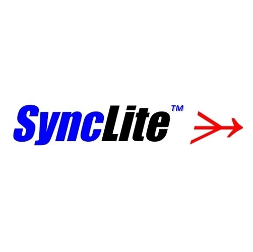
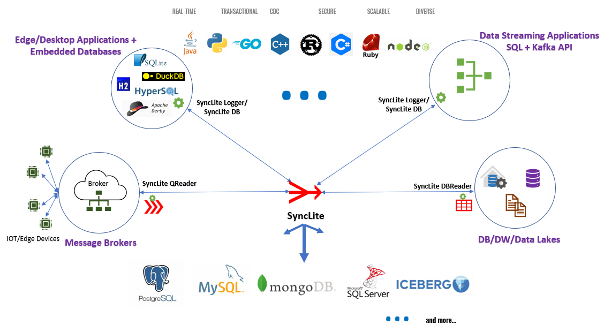

<p align="center">
  <a href="https://www.synclite.io">
  
  </a>
  <p align="center">
<<<<<<< Updated upstream
    <a href="https://www.synclite.io">Learn more</a>
=======
    <a href="https://www.synclite.io">Website</a>
    ·
    <a href="https://www.synclite.io/resources/documentation">Documentation</a>
    ·
    <a href="https://join.slack.com/t/syncliteworkspace/shared_invite/zt-2pz945vva-uuKapsubC9Mu~uYDRKo6Jw">Slack Community</a>
>>>>>>> Stashed changes
  </p>
</p>

# SyncLite — Build Anything, Sync Anywhere

**SyncLite** is an open-source, low-code relational data synchronization and consolidation platform. It gives developers a single, coherent toolkit to:

- Build **offline-first, sync-ready edge and desktop applications** using embedded databases (SQLite, DuckDB, Apache Derby, H2, HyperSQL) that automatically replicate their data to any cloud destination.
- Stand up **last-mile data streaming pipelines** that ingest at massive scale and deliver into any database, data warehouse, or data lake.
- Configure **database ETL, replication, and migration** pipelines across heterogeneous systems with minimal code.
- Connect **IoT message brokers** to analytical databases in minutes.

All of this flows through a unified pipeline architecture: sources produce compact binary log files → files are shipped to staging storage → SyncLite Consolidator delivers them to one or more destinations in real time.

<p align="center">
  <a href="https://www.synclite.io">
  
  </a>
</p>

---

## Why SyncLite?

Most data integration problems at the edge are solved today by one of two approaches: ship everything to the cloud and query there (high latency, no offline resilience), or write custom replication code (brittle, expensive, operationally painful). SyncLite is a third way.

| | Traditional approach | SyncLite |
|---|---|---|
| **Offline resilience** | Build it yourself | Built in — embedded DB works without network |
| **Real-time sync** | Custom CDC or polling | Automatic, transactional, sub-second |
| **Language support** | Driver-specific | Any language via HTTP/JSON (SyncLite DB) |
| **Destination flexibility** | One pipeline per destination | Fan-out to many destinations from one source |
| **IoT integration** | Custom MQTT consumers | SyncLite QReader — configure in minutes |
| **ETL/migration** | Heavy ETL tools | SyncLite DBReader — lightweight, incremental |
| **Operational overhead** | High | Low — web UI, Docker, one-command deploy |

---

## Use Cases

### 🔵 Sync-Ready Edge & Desktop Applications
Embed SyncLite Logger (a JDBC driver) directly into your Java/Python app. Every SQL transaction on the local embedded database is transparently captured and shipped to the cloud — **zero replication code required**. For CRUD-first workloads, use the typed **SyncLiteStore API** (no raw SQL) with `SQLITE_STORE`, `DUCKDB_STORE`, `DERBY_STORE`, `H2_STORE`, or `HYPERSQL_STORE` device types.

```
Edge/Desktop App  +  SyncLite Logger  +  SQLite/DuckDB/Derby/H2/HyperSQL (JDBC or SyncLiteStore API)
    └──► Staging Storage ──► SyncLite Consolidator ──► Destination DB / DW / Data Lake
```

→ [synclite-logger-java](synclite-logger-java/) · [Learn more](https://www.synclite.io/synclite/sync-ready-apps)

### 🟢 Language-Agnostic Edge Apps (Any Language)
Can't use Java? Use **SyncLite DB** — an HTTP/JSON database server wrapping the same embedded databases, compatible with Python, C++, C#, Go, Rust, Ruby, Node.js, and any other language.

```
Any-Language App ──HTTP/JSON──► SyncLite DB ──► Staging Storage ──► SyncLite Consolidator ──► Destination
```

→ [synclite-db](synclite-db/) · [SDK samples (8 languages)](synclite-db/sdk-source/)

### 🟡 Large-Scale Data Streaming & Last-Mile Delivery
Use SyncLite Logger's **Kafka Producer API** (JDBC) or the fluent **SyncLiteStream API** (`insert` / `insertBatch` with auto schema-evolution) to ingest append-only events at massive throughput from thousands of concurrent streaming producer instances.

```
Streaming App  +  SyncLite Logger (Kafka API / SyncLiteStream API)  ──► Staging Storage ──► Consolidator ──► Destination
```

→ [synclite-logger-java](synclite-logger-java/) · [Learn more](https://www.synclite.io/synclite/last-mile-streaming)

### 🟠 Database ETL / Replication / Migration
Configure many-to-many, incremental or CDC-based replication and migration pipelines across heterogeneous databases — from PostgreSQL, MySQL, SQL Server, Oracle, and more.

```
Source DB(s) ──► SyncLite DBReader ──► Staging Storage ──► SyncLite Consolidator ──► Destination(s)
```

→ [synclite-dbreader](synclite-dbreader/) · [Learn more](https://www.synclite.io/solutions/smart-database-etl)

### 🔴 IoT Data Integration
Subscribe to MQTT brokers and stream IoT sensor data into any destination database or data warehouse for real-time analytics at edge, fog, and cloud.

```
IoT Devices ──MQTT──► MQTT Broker ──► SyncLite QReader ──► Staging Storage ──► Consolidator ──► Destination
```

→ [synclite-qreader](synclite-qreader/) · [Learn more](https://www.synclite.io/solutions/iot-data-connector)

### � Redis-Compatible Cache with Durable Replication (Jedis API)
Use `io.synclite.logger.Jedis` — a drop-in subclass of `redis.clients.jedis.Jedis` — to back your Redis cache with a `SQLITE_STORE` device. Every write (strings, hashes, lists, sets, sorted sets, expiry, delete) is durably committed to SyncLite before forwarding to Redis. The cache is automatically repopulated from the store on restart, and all mutations replicate downstream via SyncLite Consolidator.

```
App  +  SyncLite Jedis API  ──► SQLiteStore (local log)  ──► Staging Storage ──► Consolidator ──► Destination
                             └──► Redis (live cache)
```

→ [synclite-logger-java](synclite-logger-java/)

### �🟣 GenAI Search & RAG at the Edge
SyncLite enables a compelling architecture for GenAI Search and Retrieval-Augmented Generation (RAG): build local vector/SQL indices with embedded databases on edge devices, then continuously replicate them to a centralized embedding store and LLM backend — with no custom sync code.

→ [Learn more](https://www.synclite.io/solutions/gen-ai-search-rag)

---

## Destinations Supported

| Category | Systems |
|---|---|
| Relational (OLTP) | PostgreSQL, MySQL, Microsoft SQL Server / Azure SQL DB, SQLite, DuckDB |
| Data Lakes | Apache Iceberg |
| NoSQL | MongoDB |

## Staging Storages Supported

SFTP · Amazon S3 · MinIO · Apache Kafka · Microsoft OneDrive · Google Drive · NFS · Local file system

---

## Platform Components

| Component | Description | README |
|---|---|---|
| **SyncLite Logger** | Embeddable JDBC driver for Java/Python edge apps | [→](synclite-logger-java/README.md) |
| **SyncLite DB** | Standalone HTTP/JSON database server for any language | [→](synclite-db/README.md) |
| **SyncLite Client** | Interactive CLI for SyncLite devices | [→](synclite-client/README.md) |
| **SyncLite Consolidator** | Central real-time consolidation engine | [→](synclite-consolidator/README.md) |
| **SyncLite DBReader** | Database ETL / replication / migration tool | [→](synclite-dbreader/README.md) |
| **SyncLite QReader** | IoT MQTT connector | [→](synclite-qreader/README.md) |
| **SyncLite Job Monitor** | Unified job management and scheduling UI | [→](synclite-job-monitor/README.md) |
| **SyncLite Validator** | End-to-end integration testing tool | [→](synclite-validator/README.md) |
| **Sample Web App** | JSP/Servlet demo showing SyncLite Logger in action | [→](synclite-sample-web-app/README.md) |

---

## Build SyncLite

**Prerequisites:** Java 25, Apache Maven 3.8.6+

```bash
git clone --recurse-submodules git@github.com:syncliteio/SyncLite.git SyncLite
cd SyncLite
mvn -Drevision=oss clean install
```

The release is assembled under `SyncLite/target/synclite-platform-oss/`.

> The `bin/deploy.sh` / `bin/deploy.bat` scripts download Apache Tomcat 9.0.117 and OpenJDK 25 automatically. No manual installation needed for a quick start.

## Release Structure

```
synclite-platform-oss/
├── bin/
│   ├── deploy.sh / deploy.bat        # One-command setup: downloads Tomcat + JDK, deploys WARs
│   ├── start.sh / start.bat          # Start Tomcat + all SyncLite apps
│   ├── stop.sh / stop.bat            # Graceful shutdown
│   ├── docker-deploy.sh              # Docker image build + deploy
│   ├── docker-start.sh / docker-stop.sh
│   ├── stage/sftp/                   # Docker scripts for SFTP staging server
│   ├── stage/minio/                  # Docker scripts for MinIO staging server
│   ├── dst/postgresql/               # Docker scripts for PostgreSQL destination
│   └── dst/mysql/                    # Docker scripts for MySQL destination
│
├── lib/
│   ├── logger/java/synclite-logger-<version>.jar   # Add to your edge app classpath
│   └── consolidator/synclite-consolidator-<version>.war
│
├── tools/
│   ├── synclite-client/              # CLI client
│   ├── synclite-db/                  # SyncLite DB server
│   ├── synclite-dbreader/            # DBReader WAR + launcher
│   ├── synclite-qreader/             # QReader WAR + launcher
│   ├── synclite-job-monitor/         # Job Monitor WAR
│   └── synclite-validator/           # Validator WAR
│
└── sample-apps/
    ├── synclite-logger/java/         # Java sample apps
    ├── synclite-logger/python/       # Python sample apps
    └── synclite-logger/jsp-servlet/  # Sample web app WAR
```

---

## Quick Start (5 minutes)

### Native (Windows / Ubuntu)

```bash
cd bin/
./deploy.sh      # or deploy.bat on Windows
./start.sh       # or start.bat on Windows
```

| URL | App |
|---|---|
| http://localhost:8080/synclite-consolidator | Configure and monitor consolidation jobs |
| http://localhost:8080/synclite-sample-app | Create devices, run SQL workloads, see live sync |
| http://localhost:8080/synclite-dbreader | Set up database ETL/replication pipelines |
| http://localhost:8080/synclite-qreader | Set up IoT MQTT connector pipelines |
| http://localhost:8080/synclite-job-monitor | Manage and schedule all SyncLite jobs |
| http://localhost:8080/manager | Tomcat manager (user: `synclite` / pwd: `synclite`) |

### Docker (all-in-one)

```bash
# Edit STAGE and DST at the top of docker-deploy.sh, then:
cd bin/
./docker-deploy.sh     # Builds SyncLite container (+ optional SFTP/MinIO + PostgreSQL/MySQL)
./docker-start.sh      # Starts everything
./docker-stop.sh       # Stops everything
```

---

## Using SyncLite Logger (Java)

Add `synclite-logger-<version>.jar` to your project, then:

```java
import io.synclite.logger.*;
import java.nio.file.Path;
import java.sql.*;

Path dbDir  = Path.of(System.getProperty("user.home"), "synclite", "db");
Path dbPath = dbDir.resolve("myapp.db");
Path conf   = dbDir.resolve("synclite_logger.conf");

Class.forName("io.synclite.logger.SQLite");
SQLite.initialize(dbPath, conf);

try (Connection c = DriverManager.getConnection("jdbc:synclite_sqlite:" + dbPath);
     Statement  s = c.createStatement()) {
    s.execute("CREATE TABLE IF NOT EXISTS orders(id INT, item TEXT, qty INT)");
    s.execute("INSERT INTO orders VALUES(1, 'widget', 100)");
    // ↑ captured in a log file and shipped to staging storage automatically
}
SQLite.closeAll();
```

For other embedded databases replace `SQLite` / `synclite_sqlite` with `DuckDB` / `synclite_duckdb`, `Derby` / `synclite_derby`, `H2` / `synclite_h2`, or `HyperSQL` / `synclite_hsqldb`.

Full configuration reference: `lib/logger/synclite_logger.conf` · [Documentation](https://www.synclite.io/resources/documentation)

### SyncLiteStore API — CRUD without raw SQL

**STORE device types** (`SQLITE_STORE`, `DUCKDB_STORE`, `DERBY_STORE`, `H2_STORE`, `HYPERSQL_STORE`) expose the `SyncLiteStore` API: typed `insert` / `update` / `delete` / `selectAll` methods that handle schema evolution automatically and log every operation to the replication pipeline.

```java
import io.synclite.logger.SQLiteStore;
import io.synclite.logger.SyncLiteStore;

Class.forName("io.synclite.logger.SQLiteStore");
SQLiteStore.initialize(dbPath, conf);

try (SyncLiteStore store = SQLiteStore.open(dbPath)) {
    store.createTable("orders", new LinkedHashMap<>(Map.of(
        "id",  "INTEGER PRIMARY KEY",
        "item", "TEXT",
        "qty",  "INTEGER"
    )));
    store.insert("orders", Map.of("id", 1, "item", "widget", "qty", 100));
    store.update("orders", Map.of("qty", 150), Map.of("id", 1));
    store.delete("orders", Map.of("id", 1));
    List<Map<String, Object>> rows = store.selectAll("orders");
}
SQLiteStore.closeDevice(dbPath);
```

### SyncLiteStream API — Fluent Append-Only Ingestion

`SyncLiteStream` wraps the `STREAMING` device with a fluent `insert` / `insertBatch` API. UPDATE and DELETE are intentionally absent — this API models event flow, not mutable records.

```java
import io.synclite.logger.Streaming;
import io.synclite.logger.SyncLiteStream;

Class.forName("io.synclite.logger.Streaming");
Streaming.initialize(dbPath, conf);

try (SyncLiteStream stream = SyncLiteStream.open(dbPath)) {
    stream.createTable("events", new LinkedHashMap<>(Map.of(
        "ts",         "BIGINT",
        "event_type", "TEXT",
        "user_id",    "TEXT"
    )));
    stream.insert("events", Map.of("ts", System.currentTimeMillis(), "event_type", "SIGNUP", "user_id", "u1"));
    stream.insertBatch("events", List.of(
        Map.of("ts", System.currentTimeMillis(), "event_type", "VIEW",     "user_id", "u2", "source", "web"),
        Map.of("ts", System.currentTimeMillis(), "event_type", "PURCHASE", "user_id", "u3", "source", "app")
    ));
}
```

### Jedis (Redis-Compatible) API

`io.synclite.logger.Jedis` is a drop-in subclass of `redis.clients.jedis.Jedis`. Every write is durably committed to a `SQLITE_STORE` device before being forwarded to Redis, and the cache is repopulated from the store on restart.

```java
import io.synclite.logger.Jedis;

// Managed mode — Jedis handles SQLiteStore initialise / open / close
try (Jedis jedis = Jedis.builder(dbPath, conf, "cache-device")
        .host("localhost").port(6379).build()) {
    jedis.set("user:1:name", "Alice");
    jedis.hset("session:42", Map.of("token", "abc123", "status", "active"));
    jedis.rpush("queue", "job-1", "job-2");
    jedis.sadd("tags", "etl", "cdc");
    jedis.zadd("leaderboard", Map.of("Alice", 100.0, "Bob", 200.0));
    jedis.del("tmp");
}
```

Alternatively, supply a pre-opened `SyncLiteStore` via `Jedis.builder(store)` when managing the store lifecycle externally.

---

## Using SyncLite DB (any language)

```bash
# Start the server
cd tools/synclite-db/
./synclite-db.sh --config synclite_db.conf
```

```python
# Python client (plain HTTP — no SDK needed)
import requests, json

BASE = "http://localhost:5555/synclite"

requests.post(BASE, json={"db-type": "SQLITE", "db-path": "/tmp/myapp.db",
    "synclite-logger-config": "/tmp/synclite_logger.conf", "sql": "initialize"})

requests.post(BASE, json={"db-path": "/tmp/myapp.db",
    "sql": "CREATE TABLE IF NOT EXISTS t1(a INT, b TEXT)"})

requests.post(BASE, json={"db-path": "/tmp/myapp.db",
    "sql": "INSERT INTO t1 VALUES(?, ?)", "arguments": [[1, "hello"], [2, "world"]]})
```

SDK samples for Java, Python, C#, C++, Go, Rust, Ruby, Node.js: [synclite-db/sdk-source/](synclite-db/sdk-source/)

---

## Staging Storage Setup

Configure `local-data-stage-directory` in `synclite_logger.conf` for local/NFS staging. For remote staging (SFTP, S3, MinIO, Kafka, OneDrive, Google Drive) configure the appropriate properties and use the matching Docker helper scripts in `bin/stage/`.

Docker staging helpers:

```bash
bin/stage/sftp/docker-deploy.sh    # SFTP server
bin/stage/minio/docker-deploy.sh   # MinIO object storage
```

> ⚠️ The stage Docker scripts use default credentials. Always change usernames, passwords, and add TLS before production use.

---

## Documentation & Community

| Resource | Link |
|---|---|
| Full Documentation | https://www.synclite.io/resources/documentation |
| Website | https://www.synclite.io |
| Slack Community | https://join.slack.com/t/syncliteworkspace/shared_invite/zt-2pz945vva-uuKapsubC9Mu~uYDRKo6Jw |
| GenAI / RAG solution | https://www.synclite.io/solutions/gen-ai-search-rag |
| Database ETL solution | https://www.synclite.io/solutions/smart-database-etl |
| IoT Connector solution | https://www.synclite.io/solutions/iot-data-connector |
| Streaming solution | https://www.synclite.io/synclite/last-mile-streaming |

---

## Contributing

We welcome contributions! Please read [CONTRIBUTING.md](CONTRIBUTING.md) and [CODE_OF_CONDUCT.md](CODE_OF_CONDUCT.md) before opening a pull request.

## License

SyncLite is licensed under the [Apache License 2.0](LICENSE).


<<<<<<< Updated upstream
	Request	
	```
 	{
 		"db-path" : "C:\synclite\users\bob\synclite\job1\test.db"
  		"txn-handle": "f47ac10b-58cc-4372-a567-0e02b2c3d479"
 		"sql" : "commit"
 	}
 	```

 	Response from Server 
 	```
  	{
  		"result" : "true"
 		"message" : "Transaction committed successfully"
   	}
  	```

	- Send a request to close database   	
 	Request

	 ```
 	{
 		"db-path" : "C:\synclite\users\bob\synclite\job1\test.db"
 		"sql" : "close"
   	}
 	```
	
 	Response from Server 
 	```
  	{
  		"result" : "true"
		"message" : "Database closed successfully"
   	}
  	```
 
5. SyncLite DB (internally leveraging SyncLite Logger), creates a device stage directory at configured stage path with sql logs created for each device. These device stage directories are continuously synchronized with SyncLite consolidator for consolidating them into final destination databases.
   
6. Several such hosts, each running SyncLite DB, each of them creating several SyncLite databases/devices (i.e. embedded databases), can synchornize these embedded databases in real-time with a centralized SyncLite consolidator that aggregates the incoming data and changes, in real-time, into configured destination databases.

     
# Running Integration Tests

```SyncLite Validator``` is a GUI based tool with a war file deployed on app server, it can be launched at http://localhost:8080/synclite-validator. A test job can be configured and run to execute all the end to end integration tests which validate data consolidation functionality for various SyncLite device types.  
    
	
# Pre-Built Releases:

## SyncLite Logger

1. SyncLite Logger is is published as maven dependency :
   ```
	<!-- https://mvnrepository.com/artifact/io.synclite/synclite-logger -->
	<dependency>
	    <groupId>io.synclite</groupId>
	    <artifactId>synclite-logger</artifactId>
	    <version>#LatestVersion#</version>
	</dependency>
   ```
2. OR You can directly download the latest published synclite-logger-<version>.jar from : https://github.com/syncliteio/SyncLiteLoggerJava/blob/main/src/main/resources/ and add it as a dependency in your applications.
   
## SyncLite Consolidator

1. A docker image of SyncLite Consolidator is available on docker hub : https://hub.docker.com/r/syncliteio/synclite-consolidator

2. OR a release zip file can be downloaded from this GitHub Repo : https://github.com/syncliteio/SyncLite/releases

# Supported Systems

## Source Systems
1. Edge Applications(Java/Python) +  SyncLite Logger (wrapping embedded databases :SQLite, DuckDB, Apache Derby, H2, HyperSQL)
2. Edge Applications (any programming language) + SyncLite DB (wrapping embedded databases :SQLite, DuckDB, Apache Derby, H2, HyperSQL)
3. Databases : PostgreSQL, MySQL, MongoDB, SQLite
4. Message Brokers : Eclipse Mosquitto MQTT broker
5. Data Files : CSV ( stored on FS/S3/MinIO)

## Staging Storages
1. Local FS
2. SFTP
3. S3
4. MinIO
5. Kafka
6. Microsoft OneDrive
7. Google Drive
   
## Destination Systems
1. PostgreSQL
2. MySQL
3. MongoDB
4. Microsoft SQL Server
5. Apache Iceberg
8. ClickHouse
9. FerretDB
6. SQLite
7. DuckDB

# Patent
SyncLite is backed by patented technlogy, more info : https://www.synclite.io/resources/patent  
=======
>>>>>>> Stashed changes
