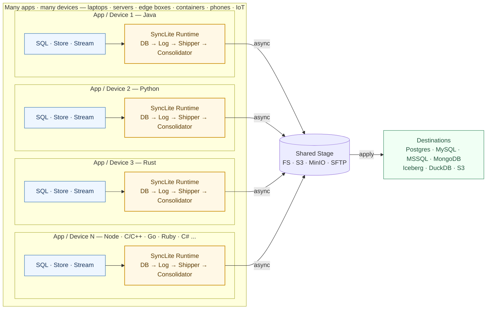
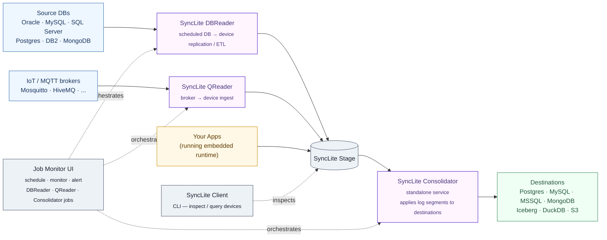

<p align="center">
  <a href="https://www.synclite.io">
  
  </a>
  <p align="center">
    <a href="https://www.synclite.io">Website</a>
    ·
    <a href="https://github.com/syncliteio/SyncLite/blob/main/DOCUMENTATION.md">Documentation</a>
    ·
  </p>
</p>

# SyncLite — The embeddable database runtime with built-in sync

**SyncLite is a lightweight, embeddable database runtime.** Drop one library into your app and you get a fully-featured embedded database (SQLite, DuckDB, Apache Derby, H2, or HyperSQL) whose every write is durably logged and continuously synced to wherever you want — another database, a data warehouse, a data lake, or just a file in object storage.

No server to install. No daemon to babysit. No CDC pipeline to wire up. Your application links a jar, a crate, or a native library and ships.

```text
your app  ──►  SyncLite Runtime (embedded DB + log + shipper + sync)  ──►  Postgres / MySQL / Snowflake / S3 / ...
```

### What you get without installing anything

- **One library, full stack.** Embedded SQL database + write-ahead logger + segment shipper + (optional) in-process consolidator — all inside your process.
- **Pick your language.** First-class **Java** (jar) and **Rust** (crate) runtimes; the Rust runtime is embeddable from **Python, Node.js, C/C++, Go, Ruby, C#** via a single `cdylib`.
- **Pick your local DB.** SQLite, DuckDB, Apache Derby, H2, HyperSQL — all behind the same APIs.
- **Pick your write style.** Plain **JDBC / SQL**, a typed **Store CRUD** API (`insert` / `update` / `delete` / `selectAll`), a fluent **Stream** append-only API, or a drop-in **Jedis** subclass for Redis users.
- **Offline-first, single binary.** Works on laptops, edge boxes, mobile-class hardware, and inside containers without any external dependency.
- **Sync is just config.** Point the runtime at a destination and writes start flowing — no separate CDC tool, no Kafka, no replication agent.

### Runtime — what your app embeds

Any number of apps / devices each embed their own runtime, in any
supported language, all sharing a stage and applying to the same
destinations — no central server in the hot path.


```mermaid
flowchart LR
    classDef app fill:#eef6ff,stroke:#2b6cb0,stroke-width:1px,color:#1a365d
    classDef rt  fill:#fff8e6,stroke:#c98a00,stroke-width:1.5px,color:#5c3a00
    classDef dst fill:#f0fff4,stroke:#2f855a,stroke-width:1px,color:#22543d

    subgraph Fleet["Many apps · many devices — laptops · servers · edge boxes · containers · phones · IoT"]
        direction TB

        subgraph App1["App / Device 1 — Java"]
            API1["SQL · Store · Stream"]:::app
            RT1["SyncLite Runtime<br/>DB → Log → Shipper → Consolidator"]:::rt
            API1 --> RT1
        end

        subgraph App2["App / Device 2 — Python"]
            API2["SQL · Store · Stream"]:::app
            RT2["SyncLite Runtime<br/>DB → Log → Shipper → Consolidator"]:::rt
            API2 --> RT2
        end

        subgraph App3["App / Device 3 — Rust"]
            API3["SQL · Store · Stream"]:::app
            RT3["SyncLite Runtime<br/>DB → Log → Shipper → Consolidator"]:::rt
            API3 --> RT3
        end

        subgraph AppN["App / Device N — Node · C/C++ · Go · Ruby · C# ..."]
            APIN["SQL · Store · Stream"]:::app
            RTN["SyncLite Runtime<br/>DB → Log → Shipper → Consolidator"]:::rt
            APIN --> RTN
        end
    end

    Stage[("Shared Stage<br/>FS · S3 · MinIO · SFTP")]
    RT1 -- async --> Stage
    RT2 -- async --> Stage
    RT3 -- async --> Stage
    RTN -- async --> Stage

    Stage -- apply --> Dst

    Dst["Destinations<br/>Postgres · MySQL · MSSQL · MongoDB<br/>Iceberg · DuckDB · S3"]:::dst
```

<sub>Inside each runtime: SQL (JDBC for Java, rusqlite for Rust, native
bindings for Python / Node / C/C++ / Go / Ruby / C#) plus the Store
CRUD and Stream APIs all sit on top of the same embedded DB, WAL
logger, shipper, and in-process consolidator.</sub>

---

## Runtime first, tools on top

SyncLite ships as two things:

1. **The Runtime** — what your application embeds. This is the core of the project: a small library that owns the local DB, the log, the shipper, and (in the full-runtime jar / Rust crate) the in-process consolidator that pushes data to destinations.
2. **Optional tooling** — webapps and CLIs built **on top of** the same runtime, for teams who want centralized ops, scheduled ETL jobs, IoT ingest, or end-to-end test harnesses. None of them are required to use the runtime in your code.

If you're a developer building an app, you only need group 1. If you're standing up a data platform, group 2 is there when you need it.

---

## Components

### Embeddable runtime — link it into your app

| Component | Description | README |
|---|---|---|
| **SyncLite for Java** (`synclite-<version>.jar`) | One jar = JDBC / Store / Stream APIs + logger + shipper + (optional) **in-process consolidator** (via bundled `synclite_jni` native). Call `initialize(dbPath, deviceName, destinationOptions)` for the single-jar topology, or `initialize(dbPath, conf)` for logger-only mode paired with the standalone Consolidator WAR. | [→](synclite-logger-java/README.md) |
| **SyncLite Rust Runtime** | Same runtime in Rust (logger + in-process consolidator) as a single `cdylib`. Consumable from **Rust, Python, Node.js, C/C++, Go, Ruby, C#** — anywhere you can load a native library. | [→](synclite-logger-rust/README.md) |
| **SyncLite DB** | Wraps the runtime as a tiny local-first HTTP/JSON service. Use it when you want the runtime accessible from a language that doesn't (yet) embed the native lib, or when multiple processes share one device. | [→](https://github.com/syncliteio/synclite-db/blob/main/README.md) |
| **SyncLite Client** | Interactive CLI for inspecting and querying SyncLite devices. | [→](https://github.com/syncliteio/synclite-client/blob/main/README.md) |

### Optional tooling — built on top of the runtime

Deploy these only when you want a managed platform. They are standard webapps that consume the same runtime under the hood.

| Component | Description | README |
|---|---|---|
| **SyncLite Consolidator** | Standalone consolidation service for the central topology — accepts log segments from many embedded devices and applies them to destinations. | [→](https://github.com/syncliteio/synclite-consolidator/blob/main/README.md) |
| **SyncLite DBReader** | Configurable database ETL / replication / migration jobs (source DB → SyncLite devices → destinations). | [→](https://github.com/syncliteio/synclite-dbreader/blob/main/README.md) |
| **SyncLite QReader** | MQTT / IoT connector that lands broker traffic into SyncLite devices. | [→](https://github.com/syncliteio/synclite-qreader/blob/main/README.md) |
| **SyncLite Job Monitor** | Unified job management and scheduling UI for DBReader / QReader / Consolidator jobs. | [→](https://github.com/syncliteio/synclite-job-monitor/blob/main/README.md) |
| **SyncLite Validator** | End-to-end integration test harness for SyncLite pipelines. | [→](https://github.com/syncliteio/synclite-validator/blob/main/README.md) |
| **Sample Web App** | JSP/Servlet demo showing the Java runtime embedded inside a real web app. | [→](https://github.com/syncliteio/synclite-sample-web-app/blob/main/README.md) |

#### Tooling — how it fits together


```mermaid
flowchart LR
    classDef src   fill:#eef6ff,stroke:#2b6cb0,color:#1a365d
    classDef tool  fill:#fef5ff,stroke:#805ad5,stroke-width:1.5px,color:#44337a
    classDef dev   fill:#fff8e6,stroke:#c98a00,color:#5c3a00
    classDef ops   fill:#edf2f7,stroke:#4a5568,color:#1a202c
    classDef dst   fill:#f0fff4,stroke:#2f855a,color:#22543d

    SrcDB["Source DBs<br/>Oracle · MySQL · SQL Server<br/>Postgres · DB2 · MongoDB"]:::src
    Brokers["IoT / MQTT brokers<br/>Mosquitto · HiveMQ · ..."]:::src
    Apps["Your Apps<br/>(running embedded runtime)"]:::dev

    DBReader["SyncLite DBReader<br/><sub>scheduled DB → device replication / ETL</sub>"]:::tool
    QReader["SyncLite QReader<br/><sub>broker → device ingest</sub>"]:::tool

    Devices[("SyncLite Stage")]:::ops

    Consolidator["SyncLite Consolidator<br/><sub>standalone service<br/>applies log segments to destinations</sub>"]:::tool

    JobMon["Job Monitor UI<br/><sub>schedule · monitor · alert<br/>DBReader · QReader · Consolidator jobs</sub>"]:::ops
    Client["SyncLite Client<br/><sub>CLI — inspect / query devices</sub>"]:::ops

    Dst["Destinations<br/>Postgres · MySQL · MSSQL · MongoDB<br/>Iceberg · DuckDB · S3"]:::dst

    SrcDB   --> DBReader  --> Devices
    Brokers --> QReader   --> Devices
    Apps    --> Devices
    Devices --> Consolidator --> Dst

    JobMon -. orchestrates .-> DBReader
    JobMon -. orchestrates .-> QReader
    JobMon -. orchestrates .-> Consolidator
    Client -. inspects .-> Devices
```

<sub>Solid lines are data flow. Dashed lines are the control plane.
Nothing in this diagram is required by the runtime — reach for these
only when you want a managed platform on top of the embedded
runtime.</sub>

---

## SyncLite Devices — three APIs over one runtime

A "device" is just a logical embedded DB that the runtime owns end-to-end (storage + log + sync). Pick the API surface that fits your code, not the other way around:

- **SQL Devices** — full SQL via JDBC (`SQLite`, `DuckDB`, `Derby`, `H2`, `HyperSQL`). Run arbitrary `CREATE` / `ALTER` / `SELECT` / `INSERT` / `UPDATE` / `DELETE`. Use this when you want a real embedded SQL DB and just happen to also want it synced.
- **Store Devices** — `SyncLiteStore` typed CRUD (`SQLITE_STORE`, `DUCKDB_STORE`, `DERBY_STORE`, `H2_STORE`, `HYPERSQL_STORE`). `insert` / `update` / `delete` / `selectAll` against plain maps; schema evolves automatically. Use this when you want a simple, stable replication contract without writing SQL.
- **Streaming Device** — `SyncLiteStream` fluent `insert` / `insertBatch` over the append-only `STREAMING` device. Use this for high-throughput event capture where UPDATE/DELETE are not needed.

All three surfaces produce the same log format and use the same shipper + consolidator under the covers, so you can mix and match devices inside a single application.

> **Which device should I pick?** Store devices (`*_STORE`) and the `STREAMING` device emit pre-formed row events that the Consolidator applies directly to the destination — no SQL-log parsing or CDC-deduction step on the apply path, so they deliver the highest end-to-end consolidation throughput. Reach for a SQL device when your app actually needs raw SQL, JOINs, multi-statement transactions in one connection, or ad-hoc DDL beyond the schema-evolution the Store API handles for you. For a brand-new app, `SQLITE_STORE` is usually the fastest *and* simplest starting point.

---

## Build SyncLite

> **Architecture support.** SyncLite is **64-bit only** — `x86_64` and `aarch64` on Windows / Linux / macOS. 32-bit hosts are not supported because the embedded Rust runtime depends on the DuckDB engine, which requires a 64-bit host.

**Prerequisites (Java-only build):** Java 25, Apache Maven 3.8.6+

**Additional prerequisites (build all loggers including Rust):**
- Rust toolchain 1.86.0
- Cargo 1.86.0 (bundled with Rust 1.86.0)
- [`cargo-zigbuild`](https://github.com/rust-cross/cargo-zigbuild) and the [Zig](https://ziglang.org/download/) compiler on `PATH`
- Rust standard libraries for Linux x86_64 and aarch64

The Rust cdylibs for **Linux x86_64 and aarch64** are cross-compiled on every
host so a single `mvn package` produces a complete, multi-arch `lib/native/`
payload. Install the cross-compile toolchain once on the build host:

```bash
cargo install cargo-zigbuild
rustup target add x86_64-unknown-linux-gnu aarch64-unknown-linux-gnu
# zig must be on PATH — download from https://ziglang.org/download/
```

> If `mvn package` fails with `error: no such command: zigbuild`, you are
> missing `cargo-zigbuild` — run `cargo install cargo-zigbuild` and retry.
> Alternatively, pass `-DskipRustCrossCompile=true` to build only the host-arch
> cdylib and skip the two Linux cross-compile steps.

macOS (`libsynclite_<rev>.dylib`) still requires running the build on a
macOS host — the Apple SDK isn't redistributable so it cannot be
cross-compiled from Windows or Linux.

```bash
git clone --recurse-submodules https://github.com/syncliteio/SyncLite.git SyncLite
cd SyncLite
```

### Build flavors

SyncLite has **three** Maven build flavors, ordered from largest to smallest output. Pick the smallest one that meets your need.

| # | Flavor | What it produces |
|---|---|---|
| 1 | **Full platform** (default) | `target/synclite-platform-<rev>.zip` — Tomcat scripts + WARs + tools + samples + multi-arch native runtime |
| 2 | **Full platform, Java-only** | Same as #1 but no `lib/native/` (no Rust toolchain required) |
| 3 | **Runtime** (recommended for app developers) | `target/synclite-runtime-<rev>.zip` — slim zip with `lib/java/` (synclite jar) + multi-arch `lib/native/` (Rust cdylibs) + `lib/python/` (ctypes wrapper) + cross-language `sample-apps/{cpp,java,python,rust}` |

```bash
# 1. Full platform (default) — Tomcat platform zip with WARs, tools, all language samples, and the multi-arch Rust runtime
mvn -Drevision=oss clean install

# 2. Full platform, Java-only — same Tomcat platform zip as #1 but no lib/native/ (no Rust toolchain required)
mvn -Drevision=oss -DskipNonJavaLoggers=true clean install

# 3. Runtime — slim embeddable zip: synclite jar + multi-arch native cdylibs + sample-apps/{cpp,java,python,rust}
mvn -Drevision=oss -DruntimeOnly=true clean install
```

> For just the synclite logger jar, or just the Rust cdylibs, build the individual subprojects directly (`cd synclite-logger-java && mvn install`, or `cd synclite-logger-rust && cargo build --workspace --release`).

### Build accelerators

These switches combine with any flavor above:

- `-DskipTests` — skip JUnit + Rust device-integration tests
- `-DskipRustCrossCompile=true` — skip the two Linux cross-compile cargo executions (use on hosts without `zig`; host-arch cdylib still built). Only relevant for flavors #1 and #3.

```bash
# Fastest full platform build (skips all tests)
mvn -Drevision=oss -DskipTests clean install

# Fastest runtime build on a host without zig — host-arch cdylib only, no Linux cross-compile, no tests
mvn -Drevision=oss -DruntimeOnly=true -DskipRustCrossCompile=true -DskipTests clean install
```

> The `bin/deploy.sh` / `bin/deploy.bat` scripts download Apache Tomcat 9.0.117 and OpenJDK 25 automatically. No manual installation needed for a quick start.

## Release Structure

### Runtime-only zip (`-DruntimeOnly=true`)

```
synclite-runtime-oss/
+-- lib/
|   +-- java/
|   |   +-- synclite-<version>.jar              # Add to your app classpath
|   |   +-- synclite.conf                       # Default logger configuration
|   +-- native/                                 # Multi-arch native cdylibs (Rust runtime)
|       +-- libsynclite_<version>.dll                 # Windows host build
|       +-- libsynclite_<version>.lib                 # Windows import library
|       +-- libsynclite_<version>_linux_x86_64.so     # cross-compiled
|       +-- libsynclite_<version>_linux_aarch64.so    # cross-compiled
|       +-- libsynclite_<version>.dylib               # only if built on macOS
|       +-- synclite.conf
+-- LICENSE
+-- synclite_platform_version.txt
```

### Full platform zip (default)

```
synclite-platform-oss/
+-- bin/
|   +-- deploy.sh / deploy.bat        # One-command setup: downloads Tomcat + JDK, deploys WARs
|   +-- start.sh / start.bat          # Start Tomcat + all SyncLite apps
|   +-- stop.sh / stop.bat            # Graceful shutdown
|   +-- docker-deploy.sh              # Docker image build + deploy
|   +-- docker-start.sh / docker-stop.sh
|   +-- stage/sftp/                   # Docker scripts for SFTP staging server
|   +-- stage/minio/                  # Docker scripts for MinIO staging server
|   +-- dst/postgresql/               # Docker scripts for PostgreSQL destination
|   +-- dst/mysql/                    # Docker scripts for MySQL destination
|
+-- lib/                              # Same as runtime-only zip above
|   +-- java/
|   +-- native/
|
+-- tools/
|   +-- synclite-client/              # CLI client
|   +-- synclite-db/                  # SyncLite DB server
|   +-- synclite-dbreader/            # DBReader WAR + launcher
|   +-- synclite-qreader/             # QReader WAR + launcher
|   +-- synclite-job-monitor/         # Job Monitor WAR
|   +-- synclite-validator/           # Validator WAR
|
+-- sample-apps/
    +-- synclite-logger/java/         # Java sample apps
    +-- synclite-logger/python/       # Python sample apps
    +-- synclite-logger/jsp-servlet/  # Sample web app WAR
```

---

## Quick Start (5 minutes)

> **Two paths:** embed SyncLite as a library in your app (single binary or jar, no installation), or deploy the full platform with the included Tomcat + Docker scripts.

---

### Path A — Embedded Runtime (no installation)

Drop one library into your app and you have logger + shipper + in-process consolidator.

#### Java (embedded runtime)

One jar — **`synclite-<version>.jar`** — gives you the JDBC / Store / Stream APIs, the logger, the shipper, and the in-process consolidator (the consolidator engine is loaded from the bundled `synclite_jni` native that's already inside the jar). The same jar works in two modes:

- **Single-jar topology** (no external service) — call `SQLite.initialize(dbPath, deviceName, destinationOptions)` and the in-process consolidator delivers writes straight to your destination.
- **Central topology** — call `SQLite.initialize(dbPath, conf)` and pair with the standalone Consolidator WAR (Path B below); writes are shipped as log segments to staging storage and consolidated centrally.

```bash
# Build everything (root pom builds the Rust natives once and bundles them into the Java jar)
mvn -DskipTests install

# Run the embedded-runtime sample
JAR=synclite-logger-java/logger/target/synclite-oss.jar
(cd synclite-logger-java/samples && javac -cp ../logger/target/synclite-oss.jar SyncliteSqlitePostgresApp.java)
java -cp "$JAR:synclite-logger-java/samples" SyncliteSqlitePostgresApp
```

End-to-end Java → PostgreSQL in one snippet (drop in the single jar, write SQL, await sync, read back):

```java
import io.synclite.*;
import java.nio.file.Path;
import java.sql.*;
import java.time.Duration;

public class SyncliteSqlitePostgresApp {
    public static void main(String[] args) throws Exception {
        Path  dbPath  = Path.of("orders.db");
        String pgUrl  = "jdbc:postgresql://localhost:5432/syncdb";
        String schema = "syncschema";

        DestinationOptions dst = DestinationOptions.builder()
                .dstType(DstType.POSTGRES)
                .connectionString(pgUrl)
                .database("syncdb").schema(schema)
                .syncMode(DstSyncMode.CONSOLIDATION).build();

        // One call: local SQLite logger + segment shipper + in-process consolidator -> PostgreSQL.
        SQLite.initialize(dbPath, "orders-device", dst);
        try {
            try (Connection c = DriverManager.getConnection("jdbc:synclite_sqlite:" + dbPath);
                 Statement  s = c.createStatement()) {
                s.execute("DROP TABLE IF EXISTS orders");
                s.execute("CREATE TABLE orders(id INTEGER PRIMARY KEY, item TEXT, qty INTEGER)");
                s.execute("INSERT INTO orders VALUES(1, 'widget', 100)");
            }
            SyncLite.awaitSync(dbPath, Duration.ofSeconds(30));   // wait for PG apply

            try (Connection pg = DriverManager.getConnection(pgUrl, "postgres", "postgres");
                 PreparedStatement ps = pg.prepareStatement(
                     "SELECT row_to_json(t)::text FROM (SELECT * FROM "
                   + schema + ".orders WHERE id = ?) t")) {
                ps.setLong(1, 1);
                try (ResultSet rs = ps.executeQuery()) {
                    System.out.println("[PG] " + (rs.next() ? rs.getString(1) : "no row"));
                }
            }
        } finally { SQLite.closeDevice(dbPath); }
    }
}
```

Full runnable sample: [`synclite-logger-java/samples/SyncliteSqlitePostgresApp.java`](synclite-logger-java/samples/SyncliteSqlitePostgresApp.java).

#### Rust / Python / C++ (embedded runtime)

```bash
# Build the Rust runtime and run a sample directly
cd synclite-code-samples/synclite-runtime/rust
cargo run --example synclite_rusqlite

# For PostgreSQL destination demo:
# cargo run --example synclite_rusqlite_postgres
```

For Rust/Python/C++ embedding via SyncLite Runtime, you do not need
`deploy.sh` / `start.sh` or platform Docker scripts.

---

### Path B — Full Platform (deploy scripts)

Use this when you want the central Consolidator + DBReader + QReader + Job Monitor + Sample Web App running as services.

#### Native (Windows / Ubuntu)

```bash
cd bin/
./deploy.sh      # or deploy.bat on Windows
./start.sh       # or start.bat on Windows
```

| URL | App |
|---|---|
| http://localhost:8080/synclite-consolidator | Configure and monitor consolidation jobs |
| http://localhost:8080/synclite-sample-app | Create devices, run SQL workloads, see live sync |
| http://localhost:8080/synclite-dbreader | Set up database ETL/replication pipelines |
| http://localhost:8080/synclite-qreader | Set up IoT MQTT connector pipelines |
| http://localhost:8080/synclite-job-monitor | Manage and schedule all SyncLite jobs |
| http://localhost:8080/manager | Tomcat manager (user: `synclite` / pwd: `synclite`) |

#### Docker (all-in-one)

```bash
# Edit STAGE and DST at the top of docker-deploy.sh, then:
cd bin/
./docker-deploy.sh     # Builds synclite-platform image (+ optional SFTP/MinIO + PostgreSQL/MySQL)
./docker-start.sh      # Starts synclite-platform container and optional helpers
./docker-stop.sh       # Stops synclite-platform container and optional helpers
```

---

## Using SyncLite Logger (Java)

Add `synclite-<version>.jar` to your project, then:

```java
import io.synclite.*;
import java.nio.file.Path;
import java.sql.*;

Path dbDir  = Path.of(System.getProperty("user.home"), "synclite", "db");
Path dbPath = dbDir.resolve("myapp.db");
Path conf   = dbDir.resolve("synclite.conf");

Class.forName("io.synclite.SQLite");
SQLite.initialize(dbPath, conf);

try (Connection c = DriverManager.getConnection("jdbc:synclite_sqlite:" + dbPath);
     Statement  s = c.createStatement()) {
    s.execute("CREATE TABLE IF NOT EXISTS orders(id INT, item TEXT, qty INT)");
    s.execute("INSERT INTO orders VALUES(1, 'widget', 100)");
    // ↑ captured in a log file and shipped to staging storage automatically
}
SQLite.closeAll();
```

For other embedded databases replace `SQLite` / `synclite_sqlite` with `DuckDB` / `synclite_duckdb`, `Derby` / `synclite_derby`, `H2` / `synclite_h2`, or `HyperSQL` / `synclite_hsqldb`.

Full configuration reference: `lib/logger/synclite.conf` · [Documentation](https://github.com/syncliteio/SyncLite/blob/main/DOCUMENTATION.md)

### SyncLiteStore API — CRUD without raw SQL

**STORE device types** (`SQLITE_STORE`, `DUCKDB_STORE`, `DERBY_STORE`, `H2_STORE`, `HYPERSQL_STORE`) expose the `SyncLiteStore` API: typed `insert` / `update` / `delete` / `selectAll` methods that handle schema evolution automatically and log every operation to the replication pipeline.

```java
import io.synclite.SQLiteStore;
import io.synclite.SyncLiteStore;

Class.forName("io.synclite.SQLiteStore");
SQLiteStore.initialize(dbPath, conf);

try (SyncLiteStore store = SQLiteStore.open(dbPath)) {
    store.createTable("orders", new LinkedHashMap<>(Map.of(
        "id",  "INTEGER PRIMARY KEY",
        "item", "TEXT",
        "qty",  "INTEGER"
    )));
    store.insert("orders", Map.of("id", 1, "item", "widget", "qty", 100));
    store.update("orders", Map.of("qty", 150), Map.of("id", 1));
    store.delete("orders", Map.of("id", 1));
    List<Map<String, Object>> rows = store.selectAll("orders");
}
SQLiteStore.closeDevice(dbPath);
```

### SyncLiteStream API — Fluent Append-Only Ingestion

`SyncLiteStream` wraps the `STREAMING` device with a fluent `insert` / `insertBatch` API. UPDATE and DELETE are intentionally absent — this API models event flow, not mutable records.

```java
import io.synclite.Streaming;
import io.synclite.SyncLiteStream;

Class.forName("io.synclite.Streaming");
Streaming.initialize(dbPath, conf);

try (SyncLiteStream stream = SyncLiteStream.open(dbPath)) {
    stream.createTable("events", new LinkedHashMap<>(Map.of(
        "ts",         "BIGINT",
        "event_type", "TEXT",
        "user_id",    "TEXT"
    )));
    stream.insert("events", Map.of("ts", System.currentTimeMillis(), "event_type", "SIGNUP", "user_id", "u1"));
    stream.insertBatch("events", List.of(
        Map.of("ts", System.currentTimeMillis(), "event_type", "VIEW",     "user_id", "u2", "source", "web"),
        Map.of("ts", System.currentTimeMillis(), "event_type", "PURCHASE", "user_id", "u3", "source", "app")
    ));
}
```

### Jedis (Redis-Compatible) API

`io.synclite.Jedis` is a drop-in subclass of `redis.clients.jedis.Jedis`. Every write is durably committed to a `SQLITE_STORE` device before being forwarded to Redis, and the cache is repopulated from the store on restart.

```java
import io.synclite.Jedis;

// Managed mode — Jedis handles SQLiteStore initialise / open / close
try (Jedis jedis = Jedis.builder(dbPath, conf, "cache-device")
        .host("localhost").port(6379).build()) {
    jedis.set("user:1:name", "Alice");
    jedis.hset("session:42", Map.of("token", "abc123", "status", "active"));
    jedis.rpush("queue", "job-1", "job-2");
    jedis.sadd("tags", "etl", "cdc");
    jedis.zadd("leaderboard", Map.of("Alice", 100.0, "Bob", 200.0));
    jedis.del("tmp");
}
```

Alternatively, supply a pre-opened `SyncLiteStore` via `Jedis.builder(store)` when managing the store lifecycle externally.

---

## Using SyncLite DB (any language)

SyncLite DB is a local-first HTTP/JSON database service that wraps embedded databases with built-in SyncLite logging and replication (by coupling it with SyncLite Consolidator), so any language can call it over HTTP.

The sample below uses Python for brevity; the same HTTP calls work from Go (`net/http`) and Node.js (`fetch` / `axios`).

```bash
# Start the server
cd tools/synclite-db
./synclite-db.sh --config synclite_db.conf
```

```python
# Python client (plain HTTP — no SDK needed)
import requests, json

BASE = "http://localhost:5555/synclite"

requests.post(BASE, json={"db-type": "SQLITE", "db-name": "myapp",
    "synclite-logger-options": {"local-data-stage-directory": "/tmp/stage"},
    "sql": "initialize"})

requests.post(BASE, json={"db-name": "myapp",
    "sql": "CREATE TABLE IF NOT EXISTS t1(a INT, b TEXT)"})

requests.post(BASE, json={"db-name": "myapp",
    "sql": "INSERT INTO t1 VALUES(?, ?)", "arguments": [[1, "hello"], [2, "world"]]})
```

```go
// Go client (plain HTTP — no SDK needed)
package main

import (
        "bytes"
        "net/http"
)

func postJSON(url string, body string) error {
        _, err := http.Post(url, "application/json", bytes.NewBufferString(body))
        return err
}

func main() {
        base := "http://localhost:5555/synclite"
        _ = postJSON(base, `{"db-type":"SQLITE","db-name":"myapp","synclite-logger-options":{"local-data-stage-directory":"/tmp/stage"},"sql":"initialize"}`)
        _ = postJSON(base, `{"db-name":"myapp","sql":"CREATE TABLE IF NOT EXISTS t1(a INT, b TEXT)"}`)
        _ = postJSON(base, `{"db-name":"myapp","sql":"INSERT INTO t1 VALUES(?, ?)","arguments":[[1,"hello"],[2,"world"]]}`)
}
```

```javascript
// Node.js client (plain HTTP — no SDK needed)
const BASE = "http://localhost:5555/synclite";

async function post(body) {
    await fetch(BASE, {
        method: "POST",
        headers: { "Content-Type": "application/json" },
        body: JSON.stringify(body),
    });
}

await post({
    "db-type": "SQLITE",
    "db-name": "myapp",
    "synclite-logger-options": { "local-data-stage-directory": "/tmp/stage" },
    sql: "initialize",
});

await post({
    "db-name": "myapp",
    sql: "CREATE TABLE IF NOT EXISTS t1(a INT, b TEXT)",
});

await post({
    "db-name": "myapp",
    sql: "INSERT INTO t1 VALUES(?, ?)",
    arguments: [[1, "hello"], [2, "world"]],
});
```

SDK samples for Java, Python, C#, C++, Go, Rust, Ruby, Node.js: [synclite-db/sdk-source/](synclite-db/sdk-source/)

---

## Staging Storage Setup

Configure `local-data-stage-directory` in `synclite.conf` for local/NFS staging. For remote staging (SFTP, S3, MinIO, Kafka, OneDrive, Google Drive) configure the appropriate properties and use the matching Docker helper scripts in `bin/stage/`.

Docker staging helpers:

```bash
bin/stage/sftp/docker-deploy.sh    # SFTP server
bin/stage/minio/docker-deploy.sh   # MinIO object storage
```

> ⚠️ The stage Docker scripts use default credentials. Always change usernames, passwords, and add TLS before production use.

---

## Documentation & Community

| Resource | Link |
|---|---|
| Full Documentation | https://github.com/syncliteio/SyncLite/blob/main/DOCUMENTATION.md |
| Website | https://www.synclite.io |

---

## Patent

SyncLite is backed by patented technology, more info: https://www.synclite.io/about

---

## Contributing

We welcome contributions! Please read [CONTRIBUTING.md](CONTRIBUTING.md) and [CODE_OF_CONDUCT.md](CODE_OF_CONDUCT.md) before opening a pull request.

## License

SyncLite is licensed under the [Apache License 2.0](LICENSE).
